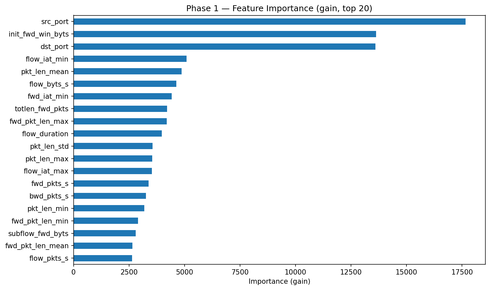

# Training Results — 2026-05-18 10:56:05

## Configuration

| Parameter | Value |
|-----------|-------|
| Random seed | `42` |
| DB path | `../data/sqlite/data.db` |
| Table | `network_data` |
| Samples per class | `615317` |
| Binary sampling (benign, attack) | `(615317, 615317)` |
| Benign label | `benign` |

## Dataset — Phase 1

Raw shape after load: `(1170112, 83)`

| Class | Rows |
|-------|------|
| `benign` | 615,317 |
| `bruteforce` | 16,397 |
| `ddos` | 76,914 |
| `dos` | 76,914 |
| `malware` | 76,914 |
| `mitm` | 76,914 |
| `recon` | 76,914 |
| `spoofing` | 76,914 |
| `web` | 76,914 |
| **Total** | **1,170,112** |

## Data Cleaning

Shape after all cleaning steps: `(1127140, 69)`

| Removal reason | Features removed |
|----------------|------------------|
| useless_features | 1 |
| high_correlation | 10 |
| near_zero_variance | 3 |

### Removed features detail

| Feature | Reason |
|---------|--------|
| `timestamp` | useless_features |
| `ack_flag_cnt` | high_correlation |
| `bwd_seg_size_avg` | high_correlation |
| `fwd_iat_max` | high_correlation |
| `fwd_iat_tot` | high_correlation |
| `fwd_seg_size_avg` | high_correlation |
| `fwd_seg_size_min` | high_correlation |
| `idle_max` | high_correlation |
| `idle_mean` | high_correlation |
| `pkt_size_avg` | high_correlation |
| `psh_flag_cnt` | high_correlation |
| `bwd_urg_flags` | near_zero_variance |
| `fwd_urg_flags` | near_zero_variance |
| `urg_flag_cnt` | near_zero_variance |

## Features

**Final numeric features: 68** (+ `label`)

`active_max`  
`active_mean`  
`active_min`  
`active_std`  
`bwd_blk_rate_avg`  
`bwd_byts_b_avg`  
`bwd_header_len`  
`bwd_iat_max`  
`bwd_iat_mean`  
`bwd_iat_min`  
`bwd_iat_std`  
`bwd_iat_tot`  
`bwd_pkt_len_max`  
`bwd_pkt_len_mean`  
`bwd_pkt_len_min`  
`bwd_pkt_len_std`  
`bwd_pkts_b_avg`  
`bwd_pkts_s`  
`bwd_psh_flags`  
`cwr_flag_count`  
`down_up_ratio`  
`dst_ip`  
`dst_port`  
`ece_flag_cnt`  
`fin_flag_cnt`  
`flow_byts_s`  
`flow_duration`  
`flow_iat_max`  
`flow_iat_mean`  
`flow_iat_min`  
`flow_iat_std`  
`flow_pkts_s`  
`fwd_act_data_pkts`  
`fwd_blk_rate_avg`  
`fwd_byts_b_avg`  
`fwd_header_len`  
`fwd_iat_mean`  
`fwd_iat_min`  
`fwd_iat_std`  
`fwd_pkt_len_max`  
`fwd_pkt_len_mean`  
`fwd_pkt_len_min`  
`fwd_pkt_len_std`  
`fwd_pkts_b_avg`  
`fwd_pkts_s`  
`fwd_psh_flags`  
`idle_min`  
`idle_std`  
`init_bwd_win_byts`  
`init_fwd_win_byts`  
`pkt_len_max`  
`pkt_len_mean`  
`pkt_len_min`  
`pkt_len_std`  
`pkt_len_var`  
`protocol`  
`rst_flag_cnt`  
`src_ip`  
`src_port`  
`subflow_bwd_byts`  
`subflow_bwd_pkts`  
`subflow_fwd_byts`  
`subflow_fwd_pkts`  
`syn_flag_cnt`  
`tot_bwd_pkts`  
`tot_fwd_pkts`  
`totlen_bwd_pkts`  
`totlen_fwd_pkts`

---

## Phase 1 — Binary Classifier

**Algorithm:** LightGBM (`LGBMClassifier`)

**Fixed params:** `{'objective': 'binary', 'metric': 'binary_logloss', 'boosting_type': 'gbdt', 'random_state': 42, 'verbosity': -1, 'force_row_wise': True, 'n_jobs': 8}`

**Train / test split:** 901,712 / 225,428 flows (80/20, stratified)

### Hyperparameter Optimization (Optuna)

| Setting | Value |
|---------|-------|
| Trials | 20 |
| Timeout | 1800 s |
| CV folds | 3 (StratifiedKFold) |
| Objective | F2-score on attack class |
| Best F2-score | `0.917248` |
| Best trial | #11 |

#### Best parameters

| Parameter | Value |
|-----------|-------|
| `threshold` | `0.22636573814659125` |
| `num_leaves` | `255` |
| `max_depth` | `-1` |
| `min_child_samples` | `83` |
| `min_split_gain` | `0.8944988289892759` |
| `learning_rate` | `0.019653699597849614` |
| `n_estimators` | `588` |
| `subsample` | `0.8696498373219476` |
| `subsample_freq` | `1` |
| `colsample_bytree` | `0.7898382517586268` |
| `reg_alpha` | `0.001001632190901532` |
| `reg_lambda` | `1.2741438783241736e-05` |
| `max_bin` | `296` |

### Feature Importance



### Final Model — Parameters

| Parameter | Value |
|-----------|-------|
| `boosting_type` | `gbdt` |
| `class_weight` | `None` |
| `colsample_bytree` | `0.7898382517586268` |
| `importance_type` | `split` |
| `learning_rate` | `0.019653699597849614` |
| `max_depth` | `-1` |
| `min_child_samples` | `83` |
| `min_child_weight` | `0.001` |
| `min_split_gain` | `0.8944988289892759` |
| `n_estimators` | `588` |
| `n_jobs` | `8` |
| `num_leaves` | `255` |
| `objective` | `binary` |
| `random_state` | `42` |
| `reg_alpha` | `0.001001632190901532` |
| `reg_lambda` | `1.2741438783241736e-05` |
| `subsample` | `0.8696498373219476` |
| `subsample_for_bin` | `200000` |
| `subsample_freq` | `1` |
| `max_bin` | `296` |
| `metric` | `binary_logloss` |
| `verbosity` | `-1` |
| `force_row_wise` | `True` |

### Evaluation (test set — 225,428 flows)

Decision threshold: `0.22636573814659125`

```
              precision    recall  f1-score   support

      attack       0.82      0.95      0.88    107447
      benign       0.94      0.81      0.87    117981

    accuracy                           0.88    225428
   macro avg       0.88      0.88      0.88    225428
weighted avg       0.88      0.88      0.88    225428
```

| Class | Recall |
|-------|--------|
| Attack | `0.9458` |
| Benign | `0.8125` |

### Artifacts

| Artifact | Path |
|----------|------|
| Binary classifier | `models/binary_classifier.pkl` |
| Threshold written to script | `scripts/network_binary_ids.py` → `THRESHOLD = 0.22636573814659125` |

