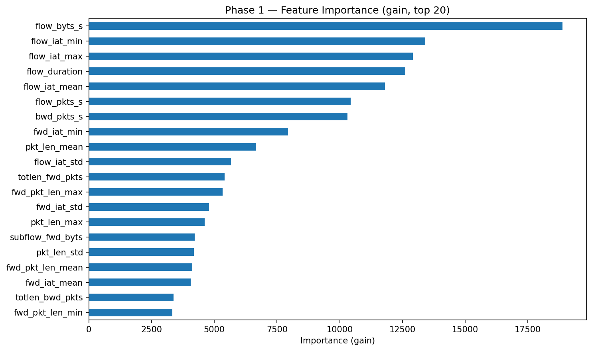
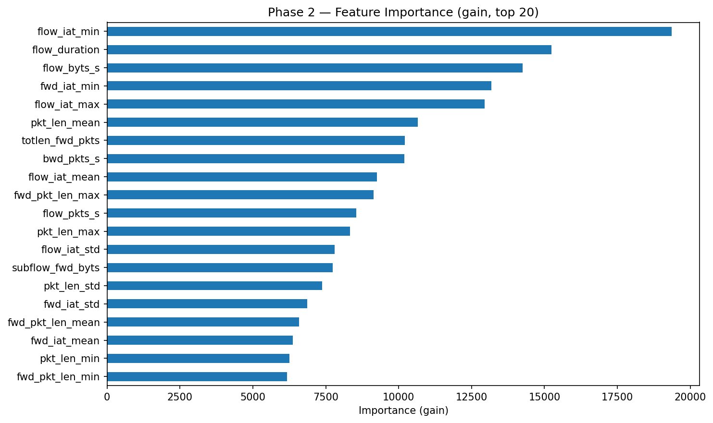
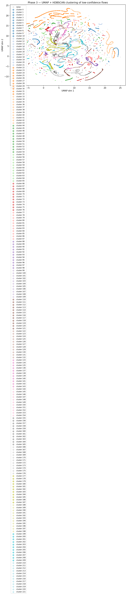

# Training Results — 2026-05-18 13:00:14

## Configuration

| Parameter | Value |
|-----------|-------|
| Random seed | `42` |
| DB path | `../data/sqlite/data.db` |
| Table | `network_data` |
| Samples per class | `615317` |
| Binary sampling (benign, attack) | `(615317, 615317)` |
| Benign label | `benign` |

## Dataset — Phase 1

Raw shape after load: `(1170112, 83)`

| Class | Rows |
|-------|------|
| `benign` | 615,317 |
| `bruteforce` | 16,397 |
| `ddos` | 76,914 |
| `dos` | 76,914 |
| `malware` | 76,914 |
| `mitm` | 76,914 |
| `recon` | 76,914 |
| `spoofing` | 76,914 |
| `web` | 76,914 |
| **Total** | **1,170,112** |

## Data Cleaning

Shape after all cleaning steps: `(704015, 56)`

| Removal reason | Features removed |
|----------------|------------------|
| useless_features | 13 |
| high_correlation | 11 |
| near_zero_variance | 3 |

### Removed features detail

| Feature | Reason |
|---------|--------|
| `bwd_blk_rate_avg` | useless_features |
| `bwd_byts_b_avg` | useless_features |
| `bwd_pkts_b_avg` | useless_features |
| `dst_ip` | useless_features |
| `dst_port` | useless_features |
| `fwd_blk_rate_avg` | useless_features |
| `fwd_byts_b_avg` | useless_features |
| `fwd_pkts_b_avg` | useless_features |
| `init_bwd_win_byts` | useless_features |
| `init_fwd_win_byts` | useless_features |
| `src_ip` | useless_features |
| `src_port` | useless_features |
| `timestamp` | useless_features |
| `ack_flag_cnt` | high_correlation |
| `bwd_seg_size_avg` | high_correlation |
| `fwd_iat_max` | high_correlation |
| `fwd_iat_tot` | high_correlation |
| `fwd_pkts_s` | high_correlation |
| `fwd_seg_size_avg` | high_correlation |
| `fwd_seg_size_min` | high_correlation |
| `idle_max` | high_correlation |
| `idle_mean` | high_correlation |
| `pkt_size_avg` | high_correlation |
| `psh_flag_cnt` | high_correlation |
| `bwd_urg_flags` | near_zero_variance |
| `fwd_urg_flags` | near_zero_variance |
| `urg_flag_cnt` | near_zero_variance |

## Features

**Final numeric features: 55** (+ `label`)

`active_max`  
`active_mean`  
`active_min`  
`active_std`  
`bwd_header_len`  
`bwd_iat_max`  
`bwd_iat_mean`  
`bwd_iat_min`  
`bwd_iat_std`  
`bwd_iat_tot`  
`bwd_pkt_len_max`  
`bwd_pkt_len_mean`  
`bwd_pkt_len_min`  
`bwd_pkt_len_std`  
`bwd_pkts_s`  
`bwd_psh_flags`  
`cwr_flag_count`  
`down_up_ratio`  
`ece_flag_cnt`  
`fin_flag_cnt`  
`flow_byts_s`  
`flow_duration`  
`flow_iat_max`  
`flow_iat_mean`  
`flow_iat_min`  
`flow_iat_std`  
`flow_pkts_s`  
`fwd_act_data_pkts`  
`fwd_header_len`  
`fwd_iat_mean`  
`fwd_iat_min`  
`fwd_iat_std`  
`fwd_pkt_len_max`  
`fwd_pkt_len_mean`  
`fwd_pkt_len_min`  
`fwd_pkt_len_std`  
`fwd_psh_flags`  
`idle_min`  
`idle_std`  
`pkt_len_max`  
`pkt_len_mean`  
`pkt_len_min`  
`pkt_len_std`  
`pkt_len_var`  
`protocol`  
`rst_flag_cnt`  
`subflow_bwd_byts`  
`subflow_bwd_pkts`  
`subflow_fwd_byts`  
`subflow_fwd_pkts`  
`syn_flag_cnt`  
`tot_bwd_pkts`  
`tot_fwd_pkts`  
`totlen_bwd_pkts`  
`totlen_fwd_pkts`

---

## Phase 1 — Binary Classifier

**Algorithm:** LightGBM (`LGBMClassifier`)

**Fixed params:** `{'objective': 'binary', 'metric': 'binary_logloss', 'boosting_type': 'gbdt', 'random_state': 42, 'verbosity': -1, 'force_row_wise': True, 'n_jobs': 8}`

**Train / test split:** 563,212 / 140,803 flows (80/20, stratified)

### Hyperparameter Optimization (Optuna)

| Setting | Value |
|---------|-------|
| Trials | 20 |
| Timeout | 1800 s |
| CV folds | 3 (StratifiedKFold) |
| Objective | F2-score on attack class |
| Best F2-score | `0.883990` |
| Best trial | #14 |

#### Best parameters

| Parameter | Value |
|-----------|-------|
| `threshold` | `0.19976531434163686` |
| `num_leaves` | `252` |
| `max_depth` | `-1` |
| `min_child_samples` | `29` |
| `min_split_gain` | `0.6552237777219547` |
| `learning_rate` | `0.06273266397315429` |
| `n_estimators` | `788` |
| `subsample` | `0.6756041056500259` |
| `subsample_freq` | `4` |
| `colsample_bytree` | `0.6800789634412052` |
| `reg_alpha` | `0.00020921039593445228` |
| `reg_lambda` | `1.218709163169383e-08` |
| `max_bin` | `512` |

### Feature Importance



### Final Model — Parameters

| Parameter | Value |
|-----------|-------|
| `boosting_type` | `gbdt` |
| `class_weight` | `None` |
| `colsample_bytree` | `0.6800789634412052` |
| `importance_type` | `split` |
| `learning_rate` | `0.06273266397315429` |
| `max_depth` | `-1` |
| `min_child_samples` | `29` |
| `min_child_weight` | `0.001` |
| `min_split_gain` | `0.6552237777219547` |
| `n_estimators` | `788` |
| `n_jobs` | `8` |
| `num_leaves` | `252` |
| `objective` | `binary` |
| `random_state` | `42` |
| `reg_alpha` | `0.00020921039593445228` |
| `reg_lambda` | `1.218709163169383e-08` |
| `subsample` | `0.6756041056500259` |
| `subsample_for_bin` | `200000` |
| `subsample_freq` | `4` |
| `max_bin` | `512` |
| `metric` | `binary_logloss` |
| `verbosity` | `-1` |
| `force_row_wise` | `True` |

### Evaluation (test set — 140,803 flows)

Decision threshold: `0.19976531434163686`

```
              precision    recall  f1-score   support

      attack       0.73      0.94      0.82     57489
      benign       0.95      0.76      0.85     83314

    accuracy                           0.84    140803
   macro avg       0.84      0.85      0.83    140803
weighted avg       0.86      0.84      0.84    140803
```

| Class | Recall |
|-------|--------|
| Attack | `0.9386` |
| Benign | `0.7647` |

### Artifacts

| Artifact | Path |
|----------|------|
| Binary classifier | `models/binary_classifier_20260518_130014.pkl` |
| Threshold written to script | `scripts/network_binary_ids.py` → `THRESHOLD = 0.19976531434163686` |

## Dataset — Phase 2

Balanced query: up to `615,317` rows per class from the DB.

Raw shape after load and cleaning: `(1586484, 56)`

| Class | Rows |
|-------|------|
| `benign` | 416,568 |
| `bruteforce` | 10,955 |
| `ddos` | 115,649 |
| `dos` | 206,428 |
| `malware` | 406,563 |
| `mitm` | 69,113 |
| `recon` | 240,114 |
| `spoofing` | 61,444 |
| `web` | 59,650 |
| **Total** | **1,586,484** |

Train / test split: `1,269,187` / `317,297` (80/20, stratified)

---

## Phase 2 — Multi-class Classifier

**Algorithm:** LightGBM (`LGBMClassifier`, multiclass)

**Fixed params:** `{'objective': 'multiclass', 'num_class': 9, 'metric': 'multi_logloss', 'boosting_type': 'gbdt', 'class_weight': 'balanced', 'random_state': 42, 'verbosity': -1, 'force_row_wise': True, 'n_jobs': 8}`

### Configuration

| Parameter | Value |
|-----------|-------|
| Samples per class (cap) | `615,317` |
| Confidence threshold (→ Phase 3) | `0.6` |
| Train size | `1,269,187` |
| Test size | `317,297` |

### Hyperparameter Optimization (Optuna)

| Setting | Value |
|---------|-------|
| Trials | 20 |
| Timeout | 1800 s |
| CV folds | 3 (StratifiedKFold) |
| Objective | Macro F1 |
| Best macro F1 | `0.699474` |
| Best trial | #2 |

#### Best parameters

| Parameter | Value |
|-----------|-------|
| `num_leaves` | `66` |
| `max_depth` | `-1` |
| `min_child_samples` | `26` |
| `min_split_gain` | `0.9741767619681504` |
| `learning_rate` | `0.04502062038376461` |
| `n_estimators` | `511` |
| `subsample` | `0.8466439478750473` |
| `subsample_freq` | `4` |
| `colsample_bytree` | `0.6732578885909489` |
| `reg_alpha` | `0.011483838528657274` |
| `reg_lambda` | `0.06073279347562471` |
| `max_bin` | `377` |

### Feature Importance



### Final Model — Parameters

| Parameter | Value |
|-----------|-------|
| `boosting_type` | `gbdt` |
| `class_weight` | `balanced` |
| `colsample_bytree` | `0.6732578885909489` |
| `importance_type` | `split` |
| `learning_rate` | `0.04502062038376461` |
| `max_depth` | `-1` |
| `min_child_samples` | `26` |
| `min_child_weight` | `0.001` |
| `min_split_gain` | `0.9741767619681504` |
| `n_estimators` | `511` |
| `n_jobs` | `8` |
| `num_leaves` | `66` |
| `objective` | `multiclass` |
| `random_state` | `42` |
| `reg_alpha` | `0.011483838528657274` |
| `reg_lambda` | `0.06073279347562471` |
| `subsample` | `0.8466439478750473` |
| `subsample_for_bin` | `200000` |
| `subsample_freq` | `4` |
| `max_bin` | `377` |
| `num_class` | `9` |
| `metric` | `multi_logloss` |
| `verbosity` | `-1` |
| `force_row_wise` | `True` |

### Evaluation (test set — 317,297 flows)

```
              precision    recall  f1-score   support

      benign       0.83      0.69      0.76     83314
  bruteforce       0.20      0.77      0.32      2191
        ddos       0.98      0.95      0.97     23130
         dos       0.98      0.95      0.96     41285
     malware       0.90      0.78      0.83     81313
        mitm       0.41      0.71      0.52     13822
       recon       0.84      0.67      0.75     48023
    spoofing       0.28      0.73      0.41     12289
         web       0.76      0.83      0.80     11930

    accuracy                           0.77    317297
   macro avg       0.69      0.79      0.70    317297
weighted avg       0.83      0.77      0.79    317297
```

### Confidence routing

| Routing | Flows | Share |
|---------|-------|-------|
| Classified by Phase 2 (confidence ≥ 0.6) | 221,086 | 69.7% |
| Forwarded to Phase 3 (confidence < 0.6) | 96,211 | 30.3% |

### Artifacts

| Artifact | Path |
|----------|------|
| Multi-class classifier | `models/multiclass_classifier_20260518_130014.pkl` |

---

## Phase 3 — Clustering (UMAP + HDBSCAN)

Input: **96,211 flows** with low Phase 2 confidence (< 0.6)

### UMAP — Dimensionality Reduction

| Parameter | Value |
|-----------|-------|
| n_components | `10` |
| n_neighbors | `30` |
| min_dist | `0.0` |
| random_state | `42` |
| Input shape | `(96211, 55)` |
| Output shape | `(96211, 10)` |

### HDBSCAN — Density Clustering

| Parameter | Value |
|-----------|-------|
| min_cluster_size | `100` |
| min_samples | `50` |
| prediction_data | `True` |

| Result | Value |
|--------|-------|
| Clusters found | `222` |
| Noise points | `14,577` (`15.2%` of inputs) |

### Cluster Distribution

| Cluster | Flows |
|---------|-------|
| noise (-1) | 14,577 |
| 0 | 494 |
| 1 | 188 |
| 2 | 202 |
| 3 | 264 |
| 4 | 358 |
| 5 | 177 |
| 6 | 1,292 |
| 7 | 125 |
| 8 | 1,752 |
| 9 | 167 |
| 10 | 157 |
| 11 | 265 |
| 12 | 147 |
| 13 | 906 |
| 14 | 510 |
| 15 | 374 |
| 16 | 193 |
| 17 | 125 |
| 18 | 117 |
| 19 | 295 |
| 20 | 235 |
| 21 | 278 |
| 22 | 202 |
| 23 | 166 |
| 24 | 340 |
| 25 | 227 |
| 26 | 157 |
| 27 | 142 |
| 28 | 3,255 |
| 29 | 1,123 |
| 30 | 1,169 |
| 31 | 150 |
| 32 | 206 |
| 33 | 319 |
| 34 | 143 |
| 35 | 447 |
| 36 | 186 |
| 37 | 685 |
| 38 | 121 |
| 39 | 166 |
| 40 | 266 |
| 41 | 194 |
| 42 | 208 |
| 43 | 341 |
| 44 | 661 |
| 45 | 166 |
| 46 | 162 |
| 47 | 195 |
| 48 | 419 |
| 49 | 190 |
| 50 | 124 |
| 51 | 153 |
| 52 | 152 |
| 53 | 252 |
| 54 | 709 |
| 55 | 136 |
| 56 | 713 |
| 57 | 606 |
| 58 | 362 |
| 59 | 635 |
| 60 | 192 |
| 61 | 227 |
| 62 | 596 |
| 63 | 134 |
| 64 | 149 |
| 65 | 278 |
| 66 | 336 |
| 67 | 549 |
| 68 | 166 |
| 69 | 150 |
| 70 | 529 |
| 71 | 240 |
| 72 | 182 |
| 73 | 145 |
| 74 | 121 |
| 75 | 509 |
| 76 | 103 |
| 77 | 225 |
| 78 | 336 |
| 79 | 191 |
| 80 | 2,042 |
| 81 | 903 |
| 82 | 329 |
| 83 | 159 |
| 84 | 319 |
| 85 | 203 |
| 86 | 256 |
| 87 | 191 |
| 88 | 152 |
| 89 | 743 |
| 90 | 112 |
| 91 | 843 |
| 92 | 211 |
| 93 | 624 |
| 94 | 231 |
| 95 | 432 |
| 96 | 165 |
| 97 | 263 |
| 98 | 213 |
| 99 | 392 |
| 100 | 133 |
| 101 | 372 |
| 102 | 182 |
| 103 | 206 |
| 104 | 126 |
| 105 | 187 |
| 106 | 613 |
| 107 | 103 |
| 108 | 255 |
| 109 | 256 |
| 110 | 292 |
| 111 | 338 |
| 112 | 249 |
| 113 | 134 |
| 114 | 350 |
| 115 | 1,325 |
| 116 | 168 |
| 117 | 312 |
| 118 | 296 |
| 119 | 217 |
| 120 | 233 |
| 121 | 241 |
| 122 | 110 |
| 123 | 959 |
| 124 | 1,500 |
| 125 | 227 |
| 126 | 966 |
| 127 | 281 |
| 128 | 226 |
| 129 | 119 |
| 130 | 702 |
| 131 | 185 |
| 132 | 399 |
| 133 | 745 |
| 134 | 437 |
| 135 | 175 |
| 136 | 107 |
| 137 | 426 |
| 138 | 219 |
| 139 | 176 |
| 140 | 696 |
| 141 | 184 |
| 142 | 403 |
| 143 | 155 |
| 144 | 174 |
| 145 | 198 |
| 146 | 267 |
| 147 | 762 |
| 148 | 143 |
| 149 | 159 |
| 150 | 422 |
| 151 | 292 |
| 152 | 461 |
| 153 | 108 |
| 154 | 171 |
| 155 | 295 |
| 156 | 324 |
| 157 | 197 |
| 158 | 183 |
| 159 | 160 |
| 160 | 905 |
| 161 | 149 |
| 162 | 393 |
| 163 | 160 |
| 164 | 313 |
| 165 | 745 |
| 166 | 362 |
| 167 | 285 |
| 168 | 454 |
| 169 | 863 |
| 170 | 219 |
| 171 | 378 |
| 172 | 381 |
| 173 | 313 |
| 174 | 100 |
| 175 | 174 |
| 176 | 293 |
| 177 | 103 |
| 178 | 303 |
| 179 | 198 |
| 180 | 458 |
| 181 | 333 |
| 182 | 258 |
| 183 | 136 |
| 184 | 440 |
| 185 | 156 |
| 186 | 234 |
| 187 | 172 |
| 188 | 258 |
| 189 | 135 |
| 190 | 1,406 |
| 191 | 537 |
| 192 | 359 |
| 193 | 533 |
| 194 | 288 |
| 195 | 190 |
| 196 | 127 |
| 197 | 270 |
| 198 | 115 |
| 199 | 113 |
| 200 | 111 |
| 201 | 382 |
| 202 | 160 |
| 203 | 479 |
| 204 | 176 |
| 205 | 201 |
| 206 | 2,512 |
| 207 | 157 |
| 208 | 386 |
| 209 | 103 |
| 210 | 255 |
| 211 | 325 |
| 212 | 154 |
| 213 | 130 |
| 214 | 165 |
| 215 | 488 |
| 216 | 1,220 |
| 217 | 539 |
| 218 | 334 |
| 219 | 261 |
| 220 | 307 |
| 221 | 269 |

### UMAP Cluster Visualisation



### Artifacts

| Artifact | Path |
|----------|------|
| UMAP reducer | `models/umap_reducer_20260518_130014.pkl` |
| HDBSCAN clusterer | `models/hdbscan_clusterer_20260518_130014.pkl` |

---

## Summary

| | |
|---|---|
| **Total training time** | `1:35:44` |
| **Phase 1 model** | `models/binary_classifier_20260518_130014.pkl` |
| **Phase 1 threshold** | `0.19976531434163686` → written to `scripts/network_binary_ids.py` |
| **Phase 2 model** | `models/multiclass_classifier_20260518_130014.pkl` |
| **Phase 3 UMAP** | `models/umap_reducer_20260518_130014.pkl` |
| **Phase 3 HDBSCAN** | `models/hdbscan_clusterer_20260518_130014.pkl` |
| **Phase 1 best F2-score** | `0.8840` |
| **Phase 2 best macro F1** | `0.6995` |
| **Phase 2 → Phase 3 routing** | `30.3%` of flows |
| **Phase 3 clusters** | `222` |

*Generated by `notebooks/training.ipynb`*
