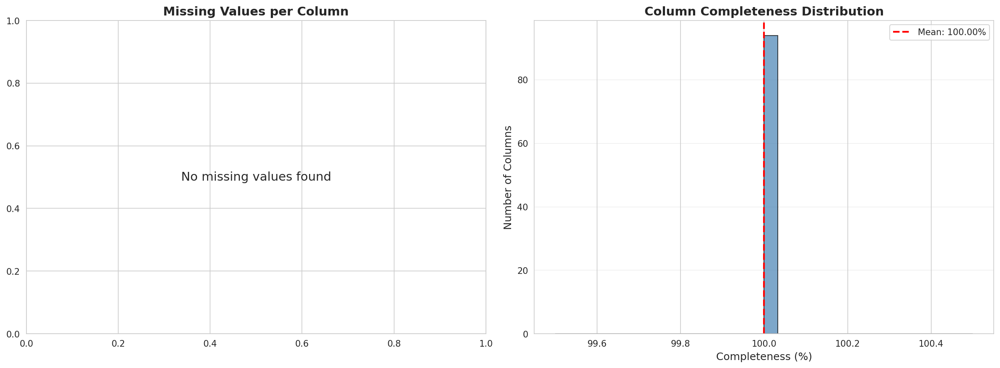
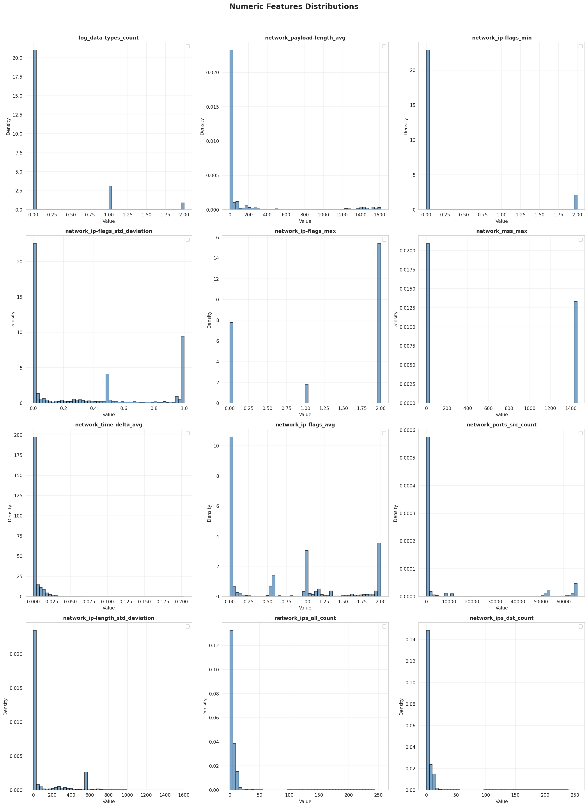
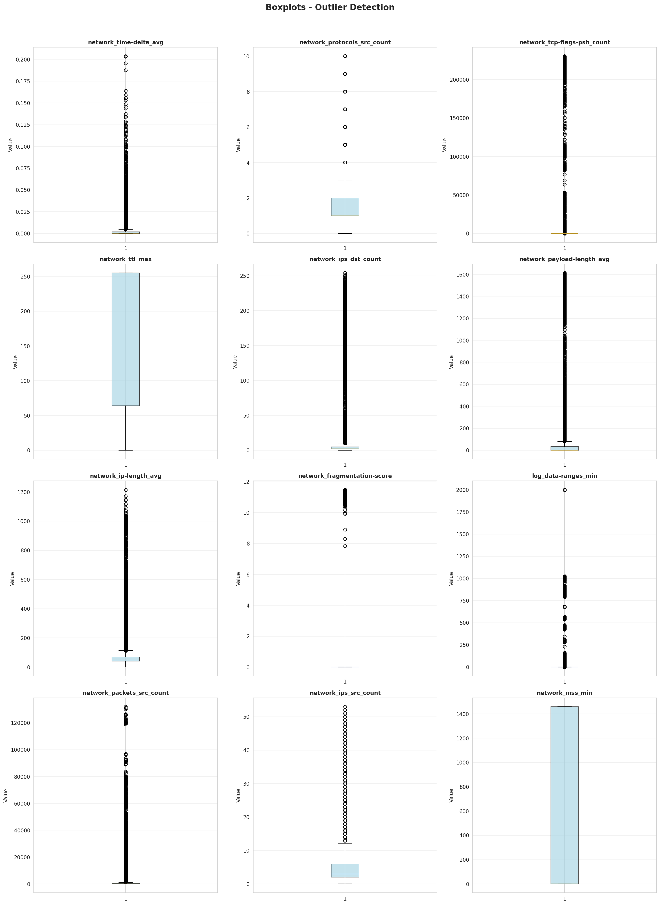
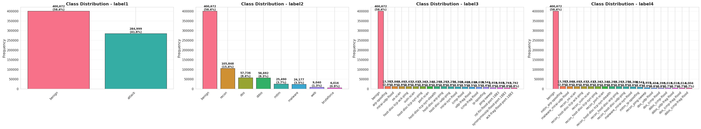
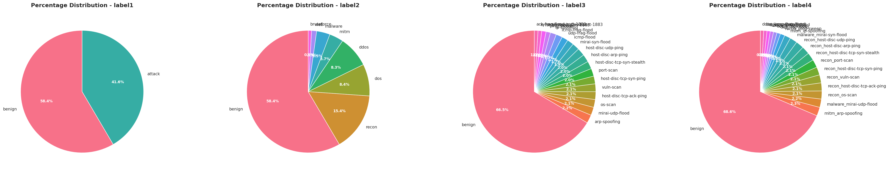
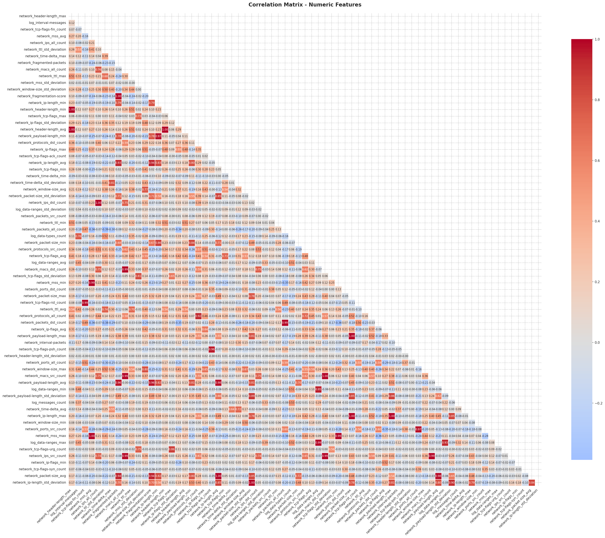
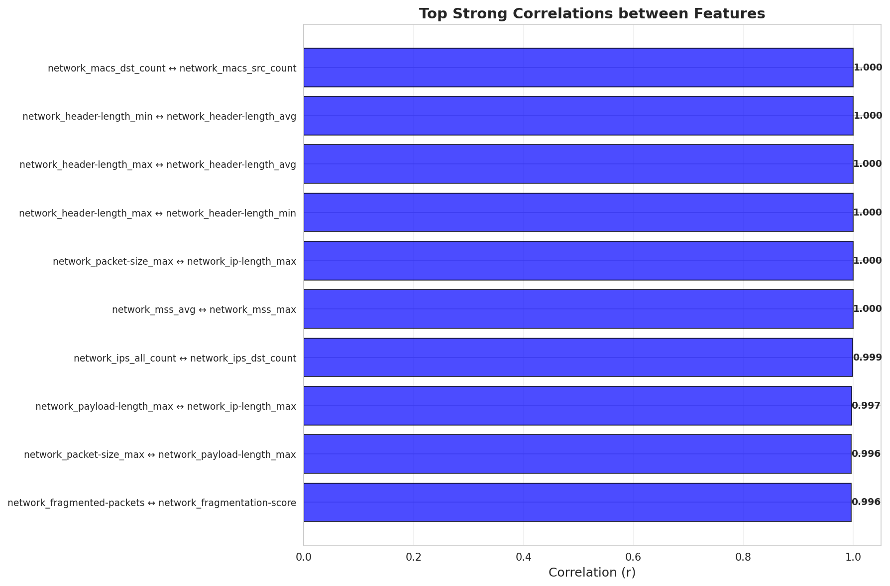

# Dataset Analysis Report
## Exploratory Dataset Analysis

This report presents a complete exploratory analysis of the CIC_IIoT_dataset_2025 dataset.

**Analysis Date**: 2026-02-18 00:34:44
**Dataset**: CIC_IIoT_dataset_2025
**Sample Size**: 685,671 records

---

## 1. Initial Dataset Characterization

### Dataset Dimensions
- **Rows**: 685,671
- **Columns**: 94

### Database Storage Size
- **Total database size**: 36565.76 MB
- **Average size per row**: ~55918.91 bytes

### Data Types
- **string**: 23 columns
- **float**: 47 columns
- **int**: 24 columns

### Column Names
Total: 94 features

1. device_name
2. device_mac
3. label_full
4. label1
5. label2
6. label3
7. label4
8. timestamp
9. timestamp_start
10. timestamp_end
11. log_data-ranges_avg
12. log_data-ranges_max
13. log_data-ranges_min
14. log_data-ranges_std_deviation
15. log_data-types
16. log_data-types_count
17. log_interval-messages
18. log_messages_count
19. network_fragmentation-score
20. network_fragmented-packets
21. network_header-length_avg
22. network_header-length_max
23. network_header-length_min
24. network_header-length_std_deviation
25. network_interval-packets
26. network_ip-flags_avg
27. network_ip-flags_max
28. network_ip-flags_min
29. network_ip-flags_std_deviation
30. network_ip-length_avg
31. network_ip-length_max
32. network_ip-length_min
33. network_ip-length_std_deviation
34. network_ips_all
35. network_ips_all_count
36. network_ips_dst
37. network_ips_dst_count
38. network_ips_src
39. network_ips_src_count
40. network_macs_all
41. network_macs_all_count
42. network_macs_dst
43. network_macs_dst_count
44. network_macs_src
45. network_macs_src_count
46. network_mss_avg
47. network_mss_max
48. network_mss_min
49. network_mss_std_deviation
50. network_packet-size_avg
51. network_packet-size_max
52. network_packet-size_min
53. network_packet-size_std_deviation
54. network_packets_all_count
55. network_packets_dst_count
56. network_packets_src_count
57. network_payload-length_avg
58. network_payload-length_max
59. network_payload-length_min
60. network_payload-length_std_deviation
61. network_ports_all
62. network_ports_all_count
63. network_ports_dst
64. network_ports_dst_count
65. network_ports_src
66. network_ports_src_count
67. network_protocols_all
68. network_protocols_all_count
69. network_protocols_dst
70. network_protocols_dst_count
71. network_protocols_src
72. network_protocols_src_count
73. network_tcp-flags-ack_count
74. network_tcp-flags-fin_count
75. network_tcp-flags-psh_count
76. network_tcp-flags-rst_count
77. network_tcp-flags-syn_count
78. network_tcp-flags-urg_count
79. network_tcp-flags_avg
80. network_tcp-flags_max
81. network_tcp-flags_min
82. network_tcp-flags_std_deviation
83. network_time-delta_avg
84. network_time-delta_max
85. network_time-delta_min
86. network_time-delta_std_deviation
87. network_ttl_avg
88. network_ttl_max
89. network_ttl_min
90. network_ttl_std_deviation
91. network_window-size_avg
92. network_window-size_max
93. network_window-size_min
94. network_window-size_std_deviation

---

## 2. Data Quality Analysis

### General Summary
- **Columns with missing values**: 0
- **Total missing values**: 0
- **Average completeness percentage**: 100.00%

### Missing values visualization

### Duplicate Analysis

- **Duplicate records**: 0
- **Duplicate percentage**: 0.00%
- **Unique records**: 685,671

✓ **No duplicates found**

---

## 3. Descriptive Statistics

### Feature Classification
- **Numeric**: 71
- **Categorical**: 23

### Descriptive Statistics - Numeric-Like Features (Mean, Std, Min, Max)

| Column | Count | Mean | Std | Min | Max |
|--------|-------|------|-----|-----|-----|
| network_header-length_max | 685,671 | 14.4844 | 8.9508 | 0.0 | 24.0 |
| log_interval-messages | 685,671 | 133.5741 | 346.989 | 0.0 | 9995.0 |
| network_tcp-flags-fin_count | 685,671 | 4499.0201 | 57348.4759 | 0.0 | 1486432.0 |
| network_mss_avg | 685,671 | 270.9329 | 567.0857 | 0.0 | 1460.0 |
| network_ips_all_count | 685,671 | 6.2478 | 23.6347 | 0.0 | 260.0 |
| network_ttl_std_deviation | 685,671 | 33.4951 | 43.7257 | 0.0 | 127.0 |
| network_time-delta_max | 685,671 | 0.036 | 0.0512 | -0.0 | 0.4722 |
| network_fragmented-packets | 685,671 | 1007.2407 | 6331.1532 | 0.0 | 69251.0 |
| network_macs_all_count | 685,671 | 3.7471 | 6.0921 | 0.0 | 53.0 |
| network_ttl_max | 685,671 | 150.3535 | 116.0116 | 0.0 | 255.0 |
| network_mss_std_deviation | 685,671 | 0.76 | 14.0911 | 0.0 | 591.3716 |
| network_window-size_std_deviation | 685,671 | 9733.2781 | 13042.4712 | 0.0 | 32767.5 |
| network_fragmentation-score | 685,671 | 0.4664 | 2.2919 | 0.0 | 13.08 |
| network_ip-length_min | 685,671 | 63.6069 | 105.0832 | 0.0 | 1076.0 |
| network_header-length_min | 685,671 | 14.4771 | 8.9447 | 0.0 | 24.0 |
| network_tcp-flags_max | 685,671 | 16.9472 | 100.7973 | 0.0 | 2242.0 |
| network_ip-flags_std_deviation | 685,671 | 0.3582 | 0.443 | 0.0 | 1.0 |
| network_header-length_avg | 685,671 | 14.4783 | 8.9455 | 0.0 | 24.0 |
| network_payload-length_min | 685,671 | 38.5296 | 106.8489 | 0.0 | 1024.0 |
| network_protocols_dst_count | 685,671 | 1.3913 | 1.6147 | 0.0 | 33.0 |
| network_ip-flags_max | 685,671 | 1.0606 | 0.9819 | 0.0 | 2.0 |
| network_tcp-flags-ack_count | 685,671 | 4819.9003 | 42086.3376 | 0.0 | 1149957.0 |
| network_ip-length_avg | 685,671 | 116.7877 | 218.6081 | 0.0 | 2481.8333 |
| network_tcp-flags_min | 685,671 | 5.6842 | 7.3183 | 0.0 | 25.0 |
| network_time-delta_min | 685,671 | 0.0032 | 0.0144 | -0.0 | 0.4091 |
| network_time-delta_std_deviation | 685,671 | 0.0085 | 0.0139 | 0.0 | 0.228 |
| network_window-size_avg | 685,671 | 11033.8624 | 15960.2888 | 0.0 | 65535.0 |
| network_packet-size_std_deviation | 685,671 | 72.054 | 170.4643 | 0.0 | 2178.2776 |
| network_ips_dst_count | 685,671 | 5.9807 | 23.622 | 0.0 | 260.0 |
| log_data-ranges_std_deviation | 685,671 | 1.2542 | 16.1927 | 0.0 | 828.1889 |
| network_packets_src_count | 685,671 | 1884.8546 | 15513.8198 | 0.0 | 637142.0 |
| network_ttl_min | 685,671 | 64.9581 | 74.8005 | 0.0 | 255.0 |
| network_packets_all_count | 685,671 | 28791.7993 | 119716.2588 | 0.0 | 1487727.0 |
| log_data-types_count | 685,671 | 0.308 | 0.5775 | 0.0 | 2.0 |
| network_packet-size_min | 685,671 | 67.4747 | 83.9698 | 0.0 | 1090.0 |
| network_protocols_src_count | 685,671 | 1.5337 | 1.416 | 0.0 | 14.0 |
| network_tcp-flags_avg | 685,671 | 8.9136 | 9.2168 | 0.0 | 208.3478 |
| log_data-ranges_avg | 685,671 | 59.8387 | 215.6092 | 0.0 | 2000.0 |
| network_macs_dst_count | 685,671 | 3.3732 | 5.8305 | 0.0 | 45.0 |
| network_tcp-flags_std_deviation | 685,671 | 2.8807 | 8.6968 | 0.0 | 627.6989 |
| network_mss_min | 685,671 | 266.6931 | 562.4755 | 0.0 | 1460.0 |
| network_ports_dst_count | 685,671 | 853.2226 | 5631.3971 | 0.0 | 65916.0 |
| network_packet-size_max | 685,671 | 400.5294 | 803.4609 | 0.0 | 11650.0 |
| network_tcp-flags-rst_count | 685,671 | 5419.6583 | 58071.4352 | 0.0 | 1486432.0 |
| network_ttl_avg | 685,671 | 97.4668 | 83.3519 | 0.0 | 255.0 |
| network_protocols_all_count | 685,671 | 1.9906 | 1.7959 | 0.0 | 34.0 |
| network_packets_dst_count | 685,671 | 26906.9448 | 115622.6209 | 0.0 | 1487601.0 |
| network_ip-flags_avg | 685,671 | 0.5715 | 0.6849 | 0.0 | 2.0 |
| network_payload-length_max | 685,671 | 363.6184 | 811.4909 | 0.0 | 11584.0 |
| network_interval-packets | 685,671 | 153.7965 | 461.8239 | 0.0 | 9471.0 |
| network_tcp-flags-psh_count | 685,671 | 3149.4591 | 39898.0425 | 0.0 | 1144412.0 |
| network_header-length_std_deviation | 685,671 | 0.0016 | 0.0512 | 0.0 | 2.0 |
| network_ports_all_count | 685,671 | 3955.8936 | 14193.3612 | 0.0 | 65916.0 |
| network_window-size_max | 685,671 | 26553.0249 | 31060.321 | 0.0 | 65535.0 |
| network_macs_src_count | 685,671 | 3.3732 | 5.8305 | 0.0 | 45.0 |
| network_payload-length_avg | 685,671 | 111.7519 | 298.7817 | 0.0 | 2429.8333 |
| log_data-ranges_min | 685,671 | 57.3982 | 210.0542 | -0.94 | 2000.0 |
| network_payload-length_std_deviation | 685,671 | 64.5199 | 165.2928 | 0.0 | 2177.1326 |
| log_messages_count | 685,671 | 1.8951 | 6.65 | 0.0 | 206.0 |
| network_time-delta_avg | 685,671 | 0.0095 | 0.0176 | -0.0 | 0.4091 |
| network_ip-length_max | 685,671 | 381.6436 | 805.1209 | 0.0 | 11636.0 |
| network_window-size_min | 685,671 | 1531.8094 | 3768.6067 | 0.0 | 65535.0 |
| network_ports_src_count | 685,671 | 3595.0081 | 13643.5846 | 0.0 | 65916.0 |
| network_mss_max | 685,671 | 271.4347 | 567.889 | 0.0 | 1460.0 |
| log_data-ranges_max | 685,671 | 61.4138 | 218.0694 | 0.0 | 2000.0 |
| network_tcp-flags-urg_count | 685,671 | 0.0221 | 0.5324 | 0.0 | 33.0 |
| network_ips_src_count | 685,671 | 3.5791 | 6.484 | 0.0 | 78.0 |
| network_ip-flags_min | 685,671 | 0.1277 | 0.4889 | 0.0 | 2.0 |
| network_tcp-flags-syn_count | 685,671 | 4148.8099 | 40906.3785 | 0.0 | 1169727.0 |
| network_packet-size_avg | 685,671 | 124.3405 | 210.1879 | 0.0 | 2229.9474 |
| network_ip-length_std_deviation | 685,671 | 69.6534 | 178.6035 | 0.0 | 2178.2776 |

### Descriptive Statistics - Categorical Features

| Column | Count | Unique_Values | Mode | Mode_% |
|--------|-------|---------------|------|-------|
| device_name | 685671 | 38 | mqtt-broker | 5.71% |
| device_mac | 685671 | 38 | dc:a6:32:dc:28:46 | 5.71% |
| label_full | 685671 | 937 | benign_whole-network3 | 58.44% |
| label1 | 685671 | 2 | benign | 58.44% |
| label2 | 685671 | 8 | benign | 58.44% |
| label3 | 685671 | 61 | benign | 58.44% |
| label4 | 685671 | 84 | benign | 58.44% |
| timestamp | 685671 | 290007 | 2025-09-09T15:09:39.400000Z_2025-09-09T15:09:40.400000Z | 0.01% |
| timestamp_start | 685671 | 92136 | 2025-09-09T14:51:40.400000Z | 0.06% |
| timestamp_end | 685671 | 92136 | 2025-09-09T14:51:40.400000Z | 0.06% |
| log_data-types | 685671 | 7 | [] | 75.22% |
| network_ips_all | 685671 | 62426 | [] | 21.32% |
| network_ips_dst | 685671 | 61777 | [] | 21.32% |
| network_ips_src | 685671 | 60642 | [] | 21.32% |
| network_macs_all | 685671 | 58491 | [] | 20.03% |
| network_macs_dst | 685671 | 56865 | [] | 20.03% |
| network_macs_src | 685671 | 53846 | [] | 20.03% |
| network_ports_all | 685671 | 205883 | [] | 30.05% |
| network_ports_dst | 685671 | 186137 | [] | 30.05% |
| network_ports_src | 685671 | 202188 | [] | 30.05% |
| network_protocols_all | 685671 | 7082 | [] | 20.03% |
| network_protocols_dst | 685671 | 4879 | [] | 29.14% |
| network_protocols_src | 685671 | 2309 | [] | 24.12% |

### Numeric features - Distributions and boxplots

---

## 4. Class Distribution Analysis

### Number of classification columns (label column):

- **label1**
- **label2**
- **label3**
- **label4**

#### Distribution of column 'label1'

| Class | Count | Percent |
|-------|-------|----------|
| benign | 400,672 | 58.44% |
| attack | 284,999 | 41.56% |

**Summary:**
- **Total classes**: 2
- **Most frequent class**: benign (58.44%)
- **Least frequent class**: attack (41.56%)
- **Imbalance ratio**: 1.41:1

✓ **Relatively balanced dataset**

#### Distribution of column 'label2'

| Class | Count | Percent |
|-------|-------|----------|
| benign | 400,672 | 58.44% |
| recon | 105,848 | 15.44% |
| dos | 57,736 | 8.42% |
| ddos | 56,692 | 8.27% |
| mitm | 25,490 | 3.72% |
| malware | 24,177 | 3.53% |
| web | 9,040 | 1.32% |
| bruteforce | 6,016 | 0.88% |

**Summary:**
- **Total classes**: 8
- **Most frequent class**: benign (58.44%)
- **Least frequent class**: bruteforce (0.88%)
- **Imbalance ratio**: 66.60:1

⚠️ **Highly imbalanced dataset!**

#### Distribution of column 'label3'

| Class | Count | Percent |
|-------|-------|----------|
| benign | 400,672 | 58.44% |
| arp-spoofing | 13,387 | 1.95% |
| mirai-udp-flood | 12,869 | 1.88% |
| os-scan | 12,491 | 1.82% |
| host-disc-tcp-ack-ping | 12,432 | 1.81% |
| vuln-scan | 12,417 | 1.81% |
| host-disc-tcp-syn-ping | 12,367 | 1.80% |
| port-scan | 12,340 | 1.80% |
| host-disc-tcp-syn-stealth | 12,299 | 1.79% |
| host-disc-arp-ping | 12,291 | 1.79% |
| host-disc-udp-ping | 12,256 | 1.79% |
| mirai-syn-flood | 11,308 | 1.65% |
| icmp-flood | 10,408 | 1.52% |
| udp-frag-flood | 10,018 | 1.46% |
| icmp-frag-flood | 10,018 | 1.46% |
| ip-spoofing | 9,541 | 1.39% |
| ping-sweep | 6,955 | 1.01% |
| rst-fin-flood-port-1883 | 6,948 | 1.01% |
| synonymousip-flood-port-1883 | 5,792 | 0.84% |
| ack-frag-flood-port-1883 | 5,792 | 0.84% |
| push-ack-flood-port-1883 | 5,788 | 0.84% |
| tcp-flood-port-1883 | 5,786 | 0.84% |
| syn-flood-port-1883 | 5,784 | 0.84% |
| udp-flood | 5,404 | 0.79% |
| synonymousip-flood-port-80 | 4,436 | 0.65% |
| ack-frag-flood-port-80 | 4,242 | 0.62% |
| push-ack-flood-port-80 | 4,234 | 0.62% |
| tcp-flood-port-80 | 4,232 | 0.62% |
| syn-flood-port-80 | 4,222 | 0.62% |
| command-injection | 3,226 | 0.47% |
| sql-injection-blind | 3,206 | 0.47% |
| dictionary-ssh | 3,103 | 0.45% |
| rst-fin-flood-port-80 | 3,086 | 0.45% |
| http-flood-port-80 | 3,076 | 0.45% |
| http-flood-port-1883 | 3,074 | 0.45% |
| dictionary-telnet | 2,913 | 0.42% |
| udp-flood-port-1883 | 2,894 | 0.42% |
| impersonation | 2,562 | 0.37% |
| udp-flood-port-80 | 2,122 | 0.31% |
| sql-injection | 1,240 | 0.18% |
| slowloris-port-80 | 1,152 | 0.17% |
| http-flood-port-6668 | 768 | 0.11% |
| xss | 698 | 0.10% |
| backdoor-upload | 670 | 0.10% |
| tcp-flood-port-554 | 568 | 0.08% |
| syn-flood-port-554 | 474 | 0.07% |
| slowloris-port-8000 | 384 | 0.06% |
| slowloris-port-554 | 384 | 0.06% |
| slowloris-port-1883 | 384 | 0.06% |
| mqtt-publish-flood | 384 | 0.06% |
| connect-flood | 384 | 0.06% |
| tcp-flood-port-443 | 380 | 0.06% |
| syn-flood-port-443 | 380 | 0.06% |
| syn-flood-port-22 | 196 | 0.03% |
| http-flood-port-9595 | 192 | 0.03% |
| http-flood-port-554 | 192 | 0.03% |
| http-flood-port-443 | 192 | 0.03% |
| tcp-flood-port-23 | 188 | 0.03% |
| tcp-flood-port-22 | 188 | 0.03% |
| syn-flood-port-23 | 188 | 0.03% |
| syn-flood-port-557 | 94 | 0.01% |

**Summary:**
- **Total classes**: 61
- **Most frequent class**: benign (58.44%)
- **Least frequent class**: syn-flood-port-557 (0.01%)
- **Imbalance ratio**: 4262.47:1

⚠️ **Highly imbalanced dataset!**

#### Distribution of column 'label4'

| Class | Count | Percent |
|-------|-------|----------|
| benign | 400,672 | 58.44% |
| mitm_arp-spoofing | 13,387 | 1.95% |
| malware_mirai-udp-flood | 12,869 | 1.88% |
| recon_os-scan | 12,491 | 1.82% |
| recon_host-disc-tcp-ack-ping | 12,432 | 1.81% |
| recon_vuln-scan | 12,417 | 1.81% |
| recon_host-disc-tcp-syn-ping | 12,367 | 1.80% |
| recon_port-scan | 12,340 | 1.80% |
| recon_host-disc-tcp-syn-stealth | 12,299 | 1.79% |
| recon_host-disc-arp-ping | 12,291 | 1.79% |
| recon_host-disc-udp-ping | 12,256 | 1.79% |
| malware_mirai-syn-flood | 11,308 | 1.65% |
| mitm_ip-spoofing | 9,541 | 1.39% |
| recon_ping-sweep | 6,955 | 1.01% |
| dos_udp-flood | 5,404 | 0.79% |
| dos_icmp-flood | 5,390 | 0.79% |
| ddos_icmp-flood | 5,018 | 0.73% |
| ddos_udp-frag-flood | 5,016 | 0.73% |
| dos_icmp-frag-flood | 5,014 | 0.73% |
| ddos_icmp-frag-flood | 5,004 | 0.73% |
| dos_udp-frag-flood | 5,002 | 0.73% |
| dos_rst-fin-flood-port-1883 | 4,050 | 0.59% |
| web_command-injection | 3,226 | 0.47% |
| web_sql-injection-blind | 3,206 | 0.47% |
| bruteforce_dictionary-ssh | 3,103 | 0.45% |
| bruteforce_dictionary-telnet | 2,913 | 0.42% |
| ddos_synonymousip-flood-port-1883 | 2,898 | 0.42% |
| ddos_rst-fin-flood-port-1883 | 2,898 | 0.42% |
| ddos_ack-frag-flood-port-1883 | 2,898 | 0.42% |
| dos_push-ack-flood-port-1883 | 2,896 | 0.42% |
| ddos_syn-flood-port-1883 | 2,896 | 0.42% |
| dos_synonymousip-flood-port-1883 | 2,894 | 0.42% |
| dos_ack-frag-flood-port-1883 | 2,894 | 0.42% |
| ddos_udp-flood-port-1883 | 2,894 | 0.42% |
| ddos_tcp-flood-port-1883 | 2,894 | 0.42% |
| dos_tcp-flood-port-1883 | 2,892 | 0.42% |
| ddos_push-ack-flood-port-1883 | 2,892 | 0.42% |
| dos_syn-flood-port-1883 | 2,888 | 0.42% |
| ddos_http-flood-port-1883 | 2,880 | 0.42% |
| mitm_impersonation | 2,562 | 0.37% |
| dos_synonymousip-flood-port-80 | 2,310 | 0.34% |
| ddos_synonymousip-flood-port-80 | 2,126 | 0.31% |
| ddos_tcp-flood-port-80 | 2,124 | 0.31% |
| ddos_rst-fin-flood-port-80 | 2,124 | 0.31% |
| dos_ack-frag-flood-port-80 | 2,122 | 0.31% |
| ddos_udp-flood-port-80 | 2,122 | 0.31% |
| ddos_push-ack-flood-port-80 | 2,120 | 0.31% |
| ddos_ack-frag-flood-port-80 | 2,120 | 0.31% |
| ddos_syn-flood-port-80 | 2,116 | 0.31% |
| ddos_http-flood-port-80 | 2,116 | 0.31% |
| dos_push-ack-flood-port-80 | 2,114 | 0.31% |
| dos_tcp-flood-port-80 | 2,108 | 0.31% |
| dos_syn-flood-port-80 | 2,106 | 0.31% |
| web_sql-injection | 1,240 | 0.18% |
| dos_rst-fin-flood-port-80 | 962 | 0.14% |
| dos_http-flood-port-80 | 960 | 0.14% |
| dos_http-flood-port-6668 | 768 | 0.11% |
| web_xss | 698 | 0.10% |
| web_backdoor-upload | 670 | 0.10% |
| dos_slowloris-port-80 | 576 | 0.08% |
| ddos_slowloris-port-80 | 576 | 0.08% |
| dos_tcp-flood-port-554 | 568 | 0.08% |
| dos_syn-flood-port-554 | 474 | 0.07% |
| dos_tcp-flood-port-443 | 380 | 0.06% |
| dos_syn-flood-port-443 | 380 | 0.06% |
| dos_syn-flood-port-22 | 196 | 0.03% |
| dos_http-flood-port-1883 | 194 | 0.03% |
| dos_slowloris-port-8000 | 192 | 0.03% |
| dos_slowloris-port-554 | 192 | 0.03% |
| dos_slowloris-port-1883 | 192 | 0.03% |
| dos_mqtt-publish-flood | 192 | 0.03% |
| dos_http-flood-port-9595 | 192 | 0.03% |
| dos_http-flood-port-554 | 192 | 0.03% |
| dos_http-flood-port-443 | 192 | 0.03% |
| dos_connect-flood | 192 | 0.03% |
| ddos_slowloris-port-8000 | 192 | 0.03% |
| ddos_slowloris-port-554 | 192 | 0.03% |
| ddos_slowloris-port-1883 | 192 | 0.03% |
| ddos_mqtt-publish-flood | 192 | 0.03% |
| ddos_connect-flood | 192 | 0.03% |
| dos_tcp-flood-port-23 | 188 | 0.03% |
| dos_tcp-flood-port-22 | 188 | 0.03% |
| dos_syn-flood-port-23 | 188 | 0.03% |
| dos_syn-flood-port-557 | 94 | 0.01% |

**Summary:**
- **Total classes**: 84
- **Most frequent class**: benign (58.44%)
- **Least frequent class**: dos_syn-flood-port-557 (0.01%)
- **Imbalance ratio**: 4262.47:1

⚠️ **Highly imbalanced dataset!**

### Class distribution - Bar and pie charts

---

## 5. Feature Analysis and Correlations

### Correlation matrix

### Cardinality Analysis - Categorical Features

**Cardinality Categories:**
- **High** (>50% unique): 0 features
- **Medium** (10-50% unique): 6 features
- **Low** (<10% unique): 17 features

---

### Key Findings

1. **Data Quality**: Excellent - 100.00% completeness, 0 missing values, 0 duplicates
2. **Data Types**: 3 unique data types - 23 categorical, 71 numeric
3. **Class Distribution**: 2 classes found in 'label1'
4. **High Cardinality**: 0 features with >90% unique values
## Appendix: Dataset Information

- **Dataset**: CIC_IIoT_dataset_2025
- **Sample Size**: 685,671 records
- **Total Features**: 94
- **Database Size**: 36565.76 MB
- **Analysis Date**: 2026-02-18 00:34:46
- **Database**: SQLite---

*Report generated from dataset_analysis.ipynb notebook*
